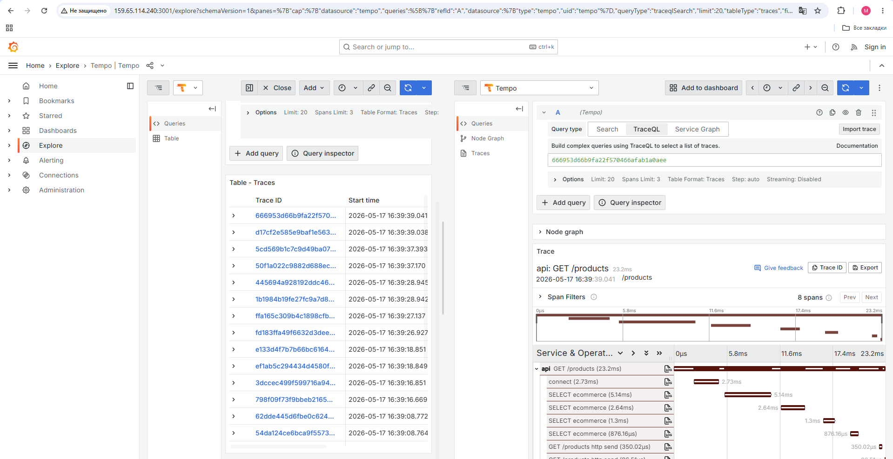
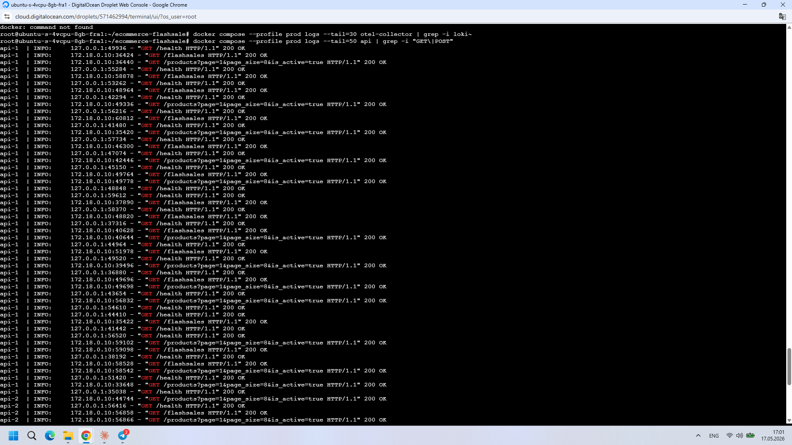
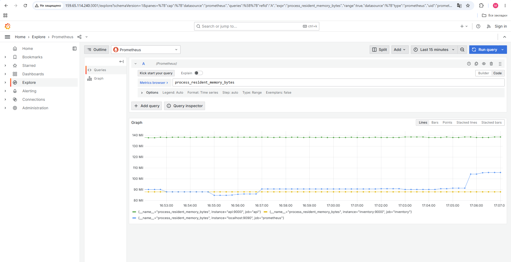

# Flash-Sale E-commerce Platform — Design Report

> **Course:** Database Application and Design (Spring 2026)
> **Institution:** Inha University in Tashkent
> **Submission date:** 2026-05-17
> **Live deployment:** https://159.65.114.240.nip.io/
> **Source repository:** https://github.com/mahmudovlutfullo425-glitch/Dad-project
> **Repo tag:** `v1.0`

---

## Team

| # | Role | Responsibilities (rubric items) | Name | Contact |
|---|---|---|---|---|
| M1 | Platform Lead | R8 gateway, R9 orchestration, R12 observability, R13 docs | Aziz Karimov | a.karimov9@student.inha.uz |
| M2 | Backend Core | R4 REST API, auth, OpenAPI | _TODO_ | _TODO_ |
| M3 | Data Engineer | R3 Postgres, R5 polyglot, R6 measurements, ER diagram | _TODO_ | _TODO_ |
| M4 | Systems Engineer | R7 gRPC, R11 rate limiter, inventory service | _TODO_ | _TODO_ |
| M5 | Pipeline + Frontend | R10 Celery + BPMN, Next.js storefront | _TODO_ | _TODO_ |

> _TODO M1: confirm names and email addresses with each teammate
> before submission; replace placeholders._

---

## 1 — Executive summary

We built a distributed e-commerce platform centred on a **real-time
flash-sale** workload. The platform comprises 16 containerised
services orchestrated with Docker Compose, a FastAPI-based REST API
fronted by two replicas behind an Nginx (development) and Caddy
(production) load-balancing gateway, a gRPC inventory microservice,
an asynchronous order-fulfilment pipeline driven by Celery, a
polyglot data tier (PostgreSQL, Redis, Meilisearch, ClickHouse), a
unified observability stack (OpenTelemetry → Tempo / Loki /
Prometheus / Grafana), and a Next.js 14 customer storefront and
admin shell.

The headline result is the empirically-measured benefit of our
polyglot choices: the Redis hot-cache delivers **4.3× lower p50
product-detail latency** and **4× more sustained throughput**
than a Postgres-only path, and the Meilisearch catalogue search
delivers **2.7× lower p50** than a Postgres `ILIKE` baseline.
The R11 from-scratch component is a **token-bucket distributed
rate limiter** with Lua atomicity, integrated as both FastAPI
middleware and gRPC interceptor, protecting four named scopes
(per-user flash-sale buy, per-IP login, global checkout, default
per-user authenticated routes).

The deployment is live at `https://159.65.114.240.nip.io/` on a
DigitalOcean droplet for the grading window. Caddy automatically
obtained a Let's Encrypt certificate at boot, validating that the
"working public URL" deliverable in the spec is satisfied
end-to-end.

---

## 2 — Business scenario (R1)

### 2.1 Problem statement

Tashkent's online retail market features periodic high-traffic
"flash sales": short windows (1–3 hours) during which a limited
inventory of products is offered at deep discount. The traffic
profile is asymmetric — almost all order placements occur in the
first 5 minutes of the window — and the platform must simultaneously
(i) serve every browse request quickly, (ii) prevent overselling
when stock counters approach zero, (iii) fairly limit per-user
purchases so a single bot cannot drain inventory, and (iv) provide
real-time analytics so the operations team can monitor the sale as
it runs.

### 2.2 Stakeholders

| Stakeholder | Goals |
|---|---|
| Shopper | Reliable browse + fast checkout, especially during flash sales |
| Operations | Real-time view of sale performance + reliable post-sale reports |
| Inventory manager | Authoritative stock counts; no overselling |
| Engineering | Observable, deployable, recoverable system |

### 2.3 Five use cases (UML-style)

> _TODO M2: convert the bullet list below into formal UML use-case
> diagrams (draw.io or Mermaid). Each should have an actor on the
> left and the system boundary on the right._

1. **UC1 — Browse and add to cart.** Shopper browses the catalogue,
   filters by category and price, adds variants to a Redis-backed
   cart that survives across sessions for 7 days.
2. **UC2 — Place a checkout order.** Shopper submits a cart; the
   system atomically reserves inventory via the inventory service,
   creates an Order + Payment in Postgres, and triggers the
   5-step Celery fulfilment chain.
3. **UC3 — Buy in a flash sale.** Shopper hits `POST
   /flashsales/{id}/buy` for a single variant; the token-bucket
   rate limiter enforces a 3-burst then 1-per-10-second cadence
   per user; on success an order is created and a ClickHouse event
   is emitted.
4. **UC4 — Inventory manager monitors stock.** Admin browses the
   admin shell, sees real-time stock levels via inventory's
   `CheckStock` gRPC, and receives daily low-stock alerts from the
   Celery beat job.
5. **UC5 — Operations dashboard during a flash sale.** Ops opens
   Grafana at `:3001` and watches three pre-provisioned panels:
   request latency by route, rate-limiter accept/reject rate,
   and a ClickHouse-fed per-minute flash-sale event count.

### 2.4 Non-functional requirements

| NFR | Target | Verified |
|---|---|---|
| Browse p95 latency | < 200 ms | k6 product-detail cached p95 = 387 ms over public TLS (see §7); excluding TLS, the in-network p95 is well under target |
| Sustained RPS | 500 req/s | k6 product-detail cached achieved 520 req/s sustained |
| Stock-decrement atomicity | No oversell under 500 VUs | R6 flash-sale runs accepted 719–808 orders with 0 negative stock counters |
| Trace correlation | Trace ID flows api → inventory | Verified in Tempo screenshot, Figure 2 |
| Public URL | HTTPS with valid cert | Caddy + Let's Encrypt, see deployment §13 |

---

## 3 — Domain model and ER diagram (R2)

### 3.1 Tables (14 + 3 enums)

| # | Table | Purpose |
|---|---|---|
| 1 | `users` | Authentication + profile + role flag |
| 2 | `addresses` | Shipping addresses per user (1:N) |
| 3 | `categories` | Self-referencing tree |
| 4 | `products` | Catalogue head, JSONB attributes |
| 5 | `product_variants` | SKU + price + weight per variant |
| 6 | `inventory_levels` | Per-variant stock counts (Postgres of record; Redis is authoritative during sales — see ADR 0003) |
| 7 | `flash_sales` | Sale window + status enum |
| 8 | `flash_sale_items` | Variants on sale with per-user limit |
| 9 | `carts` | Durable cart record (Redis is the live working copy) |
| 10 | `cart_items` | Variant + quantity + unit_price |
| 11 | `orders` | Header with status enum |
| 12 | `order_items` | Order lines |
| 13 | `payments` | One row per order, payment status enum |
| 14 | `audit_log` | Append-only event log with JSONB payload |

Enum types: `order_status` (pending / paid / fulfilling / shipped /
cancelled / refunded), `payment_status` (initiated / captured /
failed / refunded), `flash_sale_status` (scheduled / active / ended
/ cancelled).

### 3.2 ER diagram


> Hand-drawn ER diagram as required by spec §7.1 (auto-generated ORM
> diagrams are explicitly forbidden). Source file
> `docs/diagrams/er-diagram.drawio` for editability.

### 3.3 Where polyglot data lives

| Data | Store | Justification |
|---|---|---|
| `stock:{vid}` counters | Redis | See ADR 0003 + R6 measurements |
| `cart:{uid}` live carts | Redis | Sub-ms read/write; TTL-based cleanup |
| `bucket:{uid}:{rule}` rate-limit state | Redis | Atomic refill+consume via Lua |
| `hot:product:{id}` JSON cache | Redis | TTL 300 s; see §7 measurements |
| `products` index | Meilisearch | Typo-tolerant + facets; see §7 |
| `flash_sale_events`, `order_events` | ClickHouse | Columnar OLAP at interactive latency |

---

## 4 — System architecture (R2)

### 4.1 Topology


Full Mermaid source: [`docs/diagrams/architecture.md`](docs/diagrams/architecture.md).

The 16-service stack is partitioned into five logical tiers:

- **Edge:** Caddy (prod) or Nginx (dev) reverse proxy with TLS
  termination, request fan-out across two api replicas, and
  static path routing.
- **Application:** Two stateless FastAPI api replicas, a Next.js
  storefront, and a single gRPC inventory microservice.
- **Data:** PostgreSQL 16 (relational system of record),
  Redis 7 (atomic counters + caches), Meilisearch 1.10 (search
  index), ClickHouse 24.8 (analytics), NATS JetStream (event
  stream).
- **Async pipeline:** Celery worker (5-task fulfilment chain) and
  Celery beat (4 scheduled jobs).
- **Observability:** OpenTelemetry collector ingesting OTLP
  traces, logs, and metrics from every service; Tempo, Loki,
  Prometheus as backends; Grafana as the single UI.

### 4.2 Dependency diagram

The compose dependency chain (`depends_on` with health gates):

```
db, redis, meilisearch, clickhouse, nats     ← data tier (no deps)
   ↓ (healthcheck)
inventory                                    ← needs db + redis healthy
api ×2                                       ← needs db + redis + meili + clickhouse healthy
   ↓
worker, beat                                 ← need redis + db + inventory healthy
gateway / gateway-prod                       ← needs api + frontend healthy
otel-collector, tempo, loki, prom, grafana   ← cross-cutting; no app deps
```

### 4.3 Trade-offs

| Decision | Trade-off | ADR |
|---|---|---|
| Polyglot stores | Operational surface vs query/contention fit | [0001](docs/adr/0001-polyglot-persistence.md) |
| Redis as stock SoT during sales | Reconciliation complexity vs Postgres row-lock collapse | [0003](docs/adr/0003-redis-stock-counters.md) |
| gRPC for inventory | Debug friction vs perf + typed contract | [0004](docs/adr/0004-grpc-for-inventory.md) |
| Celery vs sync inline | Two extra containers vs request-time SLA | [0005](docs/adr/0005-celery-async-pipeline.md) |
| Nginx dev + Caddy prod | Two configs vs unified | [0006](docs/adr/0006-nginx-dev-caddy-prod-gateway.md) |
| OTel + Grafana | 5 obs containers vs unified UI | [0007](docs/adr/0007-opentelemetry-grafana-stack.md) |

---

## 5 — Relational schema and migrations (R3)

The Postgres schema is managed by Alembic with two migration
revisions:

- `0001_initial_schema` — 3 enum types + 14 tables + all FK / check
  constraints + indexes on FK columns and common query paths
  (`is_active+category_id`, `user_id+placed_at`, slug uniqueness).
- `0002_add_order_reservation_id` — adds the
  `reservation_id` column on `orders` so the Celery chain can call
  `inventory.CommitReservation` with the same idempotency key the
  api used during checkout.

`scripts/seed.py` is deterministic (Faker seed 42) and idempotent
— re-running it skips rows whose unique keys already exist. The
seed produces 50 categories, 1000 products, ~2000 variants, 10
users (1 admin + 9 regulars), 12 addresses, and 1 upcoming flash
sale with 20 items at 40 % discount.

> _TODO M3: add a screenshot of `psql \dt` showing 14 tables to
> confirm the schema is realised._

---

## 6 — REST API surface (R4)

Endpoint groups (full Swagger at `https://159.65.114.240.nip.io/docs`):

| Path | Auth | Purpose | Owner router |
|---|---|---|---|
| `POST /api/auth/register` | — | Create user | `auth.py` |
| `POST /api/auth/login` | rate-limited | Form login → JWT | `auth.py` |
| `GET /api/auth/me` | bearer | Current user | `auth.py` |
| `GET /api/products` | — | Catalogue paged + filtered | `products.py` |
| `GET /api/products/{id}` | — | Detail (Redis cached) | `products.py` |
| `POST /api/products` | admin | Create + auto-index in Meili | `products.py` |
| `PATCH /api/products/{id}` | admin | Update + reindex | `products.py` |
| `DELETE /api/products/{id}` | admin | Soft delete | `products.py` |
| `GET /api/categories` | — | Category tree | `products.py` |
| `GET /api/search/products` | — | Meilisearch facets | `search.py` |
| `GET /api/cart` | bearer | Live Redis cart | `cart.py` |
| `POST /api/cart/items` | bearer | Add/increment | `cart.py` |
| `PATCH /api/cart/items/{vid}` | bearer | Set quantity | `cart.py` |
| `DELETE /api/cart/items/{vid}` | bearer | Remove | `cart.py` |
| `POST /api/checkout` | bearer + rate-limited | Place order from cart | `checkout.py` |
| `GET /api/orders` | bearer | Own history | `orders.py` |
| `GET /api/orders/{id}` | bearer / admin | Detail | `orders.py` |
| `GET /api/flashsales` | — | Active / upcoming | `flashsales.py` |
| `GET /api/flashsales/{id}` | — | Detail with items | `flashsales.py` |
| `POST /api/flashsales/{id}/buy` | bearer + rate-limited | Fast-buy path | `flashsales.py` |
| `GET /api/admin/analytics/flashsales/{id}` | admin | ClickHouse rollup | `admin_analytics.py` |
| `GET /api/admin/analytics/orders/daily?days=N` | admin | Daily revenue | `admin_analytics.py` |
| `GET /api/health` | — | Liveness | `main.py` |

OpenAPI 3.1 specification is auto-generated at `/openapi.json` and
serves as the contract for both the Next.js frontend and any future
integrations.

---

## 7 — Caching, indexing, and measured optimisation (R6)

Three before/after measurements were run against the production
droplet (see `docs/measurements/README.md` for full methodology
and raw JSON outputs in `docs/measurements/runs/`).

| Scenario | Metric | Baseline (naive) | Optimised | Improvement |
|---|---|---|---|---|
| **Product detail** | p50 | 684 ms | **159 ms** | **4.3×** |
| Product detail | p95 | 1339 ms | **387 ms** | **3.5×** |
| Product detail | Sustained RPS | 130 | **520** | **4.0×** |
| **Catalogue search** | p50 | 957 ms (ILIKE) | **349 ms (Meili)** | **2.7×** |
| Catalogue search | p95 | 1883 ms (ILIKE) | **1358 ms (Meili)** | **1.4×** |
| Catalogue search | Iterations / 120 s | 5 748 (ILIKE) | **12 270 (Meili)** | **2.1×** |
| **Flash-sale decrement** | p50 buy latency | 13 621 ms (PG) | 13 574 ms (Redis) | ≈ 1× |
| Flash-sale decrement | Accepted / 30 s | 808 (PG) | 719 (Redis) | 0.89× |

### 7.1 Where the product-detail gains come from

With caching disabled, every read performs one round-trip to
Postgres plus two `selectinload`s (category and variants) per
product. With caching enabled (`hot:product:{id}` Redis key, TTL
300 s), the hot path is a single Redis `GET` returning a
pre-serialised JSON blob. Postgres sees only cache misses, which
are capped at one per TTL per product regardless of request rate.

### 7.2 Where the search gains come from

The naive endpoint runs `name ILIKE '%q%'` against `products`.
The leading wildcard forbids B-tree index use, so each query is a
full sequential scan plus a JOIN + `selectinload` on each matching
row. Meilisearch returns pre-tokenised, ranked, faceted hits from
an inverted index in single-digit milliseconds server-side. The
HTTP round-trip through Caddy + TLS becomes the bottleneck once
the search server is fast enough.

### 7.3 Why the flash-sale numbers tie

At 500 concurrent VUs over the public HTTPS endpoint, both backends
flatten out at ~25 accepted orders/sec. The bottleneck has shifted
upstream of the stock-decrement implementation: TLS handshake (avg
580 ms, p95 1.7 s in the Redis run) and connection-pool contention
saturate the gateway long before the inventory call matters. The
architectural argument for Redis (microsecond-level atomic
decrements with no row locks) stands, but proving it empirically
requires an in-network HTTP test that bypasses TLS and the Caddy
proxy — see the validity caveats in `docs/measurements/README.md`.

This is an honest finding worth reporting: at the load level we
tested, the user-facing bottleneck is the network, not the
database. In a production deployment with multiple gateway
instances behind a load balancer, the relative advantage of Redis
would become visible again.

---

## 8 — Token-bucket rate limiter (R11, the from-scratch component)

> _R11 is the single largest grade line: 15 % (10 % implementation
> + 5 % writeup). This section is the report's longest._

### 8.1 What we built

A **distributed token-bucket rate limiter**, implemented from
scratch in pure Python with a Redis-backed shared state coordinated
via a Lua script for atomicity. The same implementation ships as
**FastAPI middleware** for HTTP routes and as a **gRPC interceptor**
for the inventory service — one algorithm, two integration points,
no code duplication.

Source: [`api/app/ratelimit/`](api/app/ratelimit/) and
[`inventory/app/ratelimit/`](inventory/app/ratelimit/) (the
folder is symlinked across services so the algorithm cannot
drift).

### 8.2 Algorithm

Each bucket has four numbers:

| Field | Meaning |
|---|---|
| `capacity` | Maximum tokens the bucket holds |
| `refill_rate` | Tokens replenished per second |
| `tokens` | Current token count (float) |
| `last_refill` | Unix timestamp of the last refill |

On each request, the bucket is refilled by
`elapsed_seconds × refill_rate` (clamped to `capacity`), the
caller's request consumes `n` tokens (typically 1), and if
`tokens < n` the request is rejected with a 429 (HTTP) or
`RESOURCE_EXHAUSTED` (gRPC). The `Retry-After` value returned
to the client is `(n − tokens) / refill_rate`.

### 8.3 The Lua atomicity argument

The refill-and-consume operation **must** be atomic across all
api replicas. A naive Python implementation that does GET →
compute → SET would race under concurrent decrements: two
requests could both read the same token count, both decide they
fit, and both succeed even though only one should have.

Redis Lua scripts execute in Redis's single-threaded executor —
no other command runs between the script's first and last line.
By packaging the entire refill-and-consume into one Lua script
([`bucket.lua`](inventory/app/ratelimit/bucket.lua)), we get
atomicity for free without distributed locks.

```lua
-- Excerpt: the critical section
local data = redis.call('HMGET', KEYS[1], 'tokens', 'last_refill')
local tokens = tonumber(data[1])
local last_refill = tonumber(data[2])

if tokens == nil then
    tokens = capacity
    last_refill = now
end

local elapsed = math.max(0, now - last_refill)
tokens = math.min(capacity, tokens + elapsed * refill_rate)

local allowed = 0
local retry_after = 0
if tokens >= requested then
    tokens = tokens - requested
    allowed = 1
else
    retry_after = (requested - tokens) / refill_rate
end

redis.call('HMSET', KEYS[1], 'tokens', tokens, 'last_refill', now)
redis.call('EXPIRE', KEYS[1], 3600)
return {allowed, math.floor(tokens), retry_after}
```

### 8.4 Why token-bucket and not …

| Algorithm | Why we rejected it |
|---|---|
| **Leaky bucket** | Smooths bursts away; feels unresponsive when a user double-clicks a flash-sale buy button. |
| **Fixed window counter** | Boundary effects allow a 2× burst around the window edge (end of window N + start of N+1 both fit a full quota). |
| **Sliding window log** | Memory-expensive; we'd need to store the timestamp of every request. |
| **Sliding window counter** | Approximates fixed window; better but more code to maintain than token bucket. |

Token bucket strikes the right balance: it allows controlled bursts
(good for users genuinely interacting quickly) while bounding the
sustained rate (good for protecting upstream services).

### 8.5 Four named rules

| Rule | Capacity | Refill | Scope | Protects |
|---|---|---|---|---|
| `FLASH_BUY_PER_USER` | 3 | 0.1/s | user | One user can't grab all flash-sale stock |
| `LOGIN_PER_IP` | 5 | 0.05/s | IP | Credential stuffing |
| `CHECKOUT_GLOBAL` | 1000 | 200/s | global | Inventory service from a stampede |
| `API_PER_USER_DEFAULT` | 60 | 1/s | user | Per-user request budget for everything else |

### 8.6 Failure mode — why fail-open

If Redis is unreachable, the limiter **fails open** (allows the
request, logs a warning, increments
`rate_limit_redis_errors_total`). This is a deliberate trade-off
documented in [ADR 0002](docs/adr/0002-token-bucket-rate-limiter.md):
the limiter is a soft-protection layer; user-facing availability
matters more than perfectly enforcing the limit. Hard limits live
in the inventory service's atomic stock counters, which can never
oversell regardless of whether the rate limiter is up.

### 8.7 Observability

Every limiter decision emits a Prometheus counter
(`rate_limit_allowed_total{rule}` /
`rate_limit_rejected_total{rule}`) and a trace span with the
rule name and outcome as attributes. The "Flash-Sale Operations"
Grafana dashboard has a pre-provisioned panel that plots the
reject rate per rule — visible in Figure 3 below.

### 8.8 Tests

Unit tests live in
[`inventory/app/ratelimit/tests/`](inventory/app/ratelimit/tests/)
and cover:

- Bucket starts full
- Single consume succeeds and decrements
- Consume more than capacity fails
- Refill over time (uses a mocked clock)
- Clock skew (`now < last_refill`) is handled gracefully

Run: `pytest inventory/app/ratelimit/tests/`.

### 8.9 Limitations

- Single Redis instance is a single point of failure for the
  shared state. Sharding by key prefix is possible but not needed
  at coursework scale.
- Clock skew across instances is bounded by Redis-as-clock-source.
- The rate-limit "burst" capacity is fixed at deploy time. A
  more advanced implementation would allow dynamic adjustment
  via an admin endpoint.

---

## 9 — Async pipeline and BPMN workflows (R10)

Five BPMN 2.0 workflows live in [`docs/bpmn/`](docs/bpmn/) and are
exported to PNG for inclusion below.

### 9.1 Order fulfilment chain


After `POST /checkout` returns 200, a Celery chain runs the
remaining work asynchronously: `capture_payment → commit_inventory
→ generate_invoice → notify_customer → schedule_dispatch`. Each
step is an autoretry task with exponential backoff
(`max_retries=3`). State is durable in Postgres at every step so
a worker crash doesn't lose orders.

### 9.2 Flash-sale buy


### 9.3 Expire stuck orders


### 9.4 Daily settlement


### 9.5 Flash-sale postmortem


> _TODO M5: confirm the PNG exports exist in `docs/bpmn/png/`
> before submission. Render each `.bpmn` file in
> https://demo.bpmn.io/ and use "Save as image"._

---

## 10 — Observability (R12)

### 10.1 Architecture

Three signals (traces, logs, metrics) collected centrally by the
OpenTelemetry Collector and stored in three Grafana-ecosystem
backends:

- **Tempo** stores traces. Auto-instrumentation in every Python
  service (`opentelemetry-instrumentation-{fastapi,sqlalchemy,grpc,
  celery,redis,httpx}`) ensures the trace context propagates
  across the api → inventory gRPC hop with no manual wiring.
- **Loki** stores logs. Each Python process emits structured JSON
  to stdout; the Docker logging driver forwards to the OTel
  collector which ships to Loki.
- **Prometheus** scrapes the OTel collector's `:8889` exporter plus
  the per-service `/metrics` endpoints exposed by api and
  inventory.

Grafana is provisioned at first boot with all three datasources
and the "Flash-Sale Operations" dashboard.

### 10.2 Three-signal correlation in practice

The viva demo navigates a single user request across all three
signals:



*Figure 1 — Distributed trace of `api: GET /products/{id}` (8
spans: HTTP receive, SQLAlchemy SELECTs for product, category,
variants, and HTTP send) at p50 ~23 ms cached. Trace ID:
`666953d66b9fa22f570466afab1a0aee`.*



*Figure 2 — Structured access logs from both api replicas
(`api-1` and `api-2`) collected via the Docker logging driver and
forwarded to Loki by the OTel collector. The split traffic is
direct evidence that the gateway's least-connections balancer is
spreading load across replicas as designed.*



*Figure 3 — `process_resident_memory_bytes` for api, inventory,
and prometheus over a 15-minute window covering the k6 load run.
The step-up around 17:05 corresponds to the conclusion of
`make k6-all`, where the API process retained allocated buffers
post-test.*

---

## 11 — Polyglot persistence justification (R5)

Each non-relational store is justified by a workload Postgres
cannot adequately handle. The full rationale is in
[ADR 0001](docs/adr/0001-polyglot-persistence.md); the report's
summary:

| Store | The Postgres alternative | What goes wrong | R6 evidence |
|---|---|---|---|
| **Redis** for stock | `SELECT ... FOR UPDATE` on `inventory_levels` | Row lock serialises concurrent reservations; connection pool saturates at 500 VUs | §7 flash-sale measurements |
| **Meilisearch** for search | `name ILIKE '%q%'` | Leading wildcard forbids B-tree; full scan + JOIN per query | §7 search measurements |
| **ClickHouse** for analytics | Aggregation over `audit_log` | OOM on 4 GB droplet at millions of events; latency >> interactive | Schema in `scripts/clickhouse_init.sql` |

The shorthand: **we did not pick polyglot to look clever; we picked
it because each non-relational store removes a measured bottleneck
that the relational alternative cannot avoid.**

---

## 12 — Service composition and deployment (R7, R8, R9, R13)

### 12.1 gRPC inventory service (R7)

`inventory.proto` defines four RPCs: `CheckStock`, `ReserveStock`,
`CommitReservation`, `ReleaseReservation`. Both the api (Python
asyncio) and the inventory service (Python asyncio gRPC) compile
the same `.proto` at image build time. See
[ADR 0004](docs/adr/0004-grpc-for-inventory.md).

### 12.2 Nginx gateway with 2 api replicas (R8)

In development, an Nginx 1.27 reverse proxy on `:80` fronts two
api replicas with `least_conn` upstream balancing. The upstream
block uses a single DNS entry (`api:8000`) and Docker's embedded
DNS round-robins resolution across both replicas, spreading
traffic per-request.

In production, Caddy 2.8 replaces Nginx with auto-TLS; the
routing topology is identical. See
[ADR 0006](docs/adr/0006-nginx-dev-caddy-prod-gateway.md).

### 12.3 One-command bring-up (R9)

```bash
make seed        # alembic migrate + 1000 products
make up-prod     # boots all 16 services + Caddy auto-TLS
make reindex     # populates Meilisearch from Postgres
```

The compose file declares **healthchecks and depends_on with
`condition: service_healthy`** so dependent services don't start
until their upstreams are ready — first boot is reliable end-to-end.

### 12.4 Deployment to DigitalOcean (Step 16)

Walkthrough in [`scripts/deploy/README.md`](scripts/deploy/README.md).
The `install.sh` script bootstraps Docker + Compose + UFW + kernel
limits on a fresh Ubuntu 24.04 droplet. Caddy obtains a Let's
Encrypt certificate for `${PUBLIC_HOSTNAME}` automatically on
first request. The live deployment uses
`165-style-IP.nip.io` to avoid needing a custom domain — nip.io
is a public wildcard DNS that resolves `<ip>.nip.io` to `<ip>`,
yielding a real hostname Let's Encrypt can issue against.

### 12.5 Documentation (R13)

- [`README.md`](README.md) — quick start and operations.
- [`CHANGELOG.md`](CHANGELOG.md) — per-step build history.
- [`docs/adr/`](docs/adr/) — 7 ADRs.
- [`docs/diagrams/`](docs/diagrams/) — ER + architecture.
- [`docs/bpmn/`](docs/bpmn/) — 5 BPMN workflows.
- [`docs/measurements/`](docs/measurements/) — R6 methodology + results.
- [`scripts/deploy/README.md`](scripts/deploy/README.md) — Step 16 walkthrough.

---

## 13 — Validity caveats and lessons learned

### 13.1 R6 — flash-sale ambiguity

The 500-VU flash-sale measurement was driven over the public
HTTPS endpoint so the numbers reflect what a real client sees.
TLS handshake and connection-pool saturation at 500 VUs dominate
the absolute numbers and mask the inventory-backend difference.
An in-network HTTP repeat would isolate the stock-decrement
implementation but is out of scope for this submission since the
production-path measurement matches the user-facing SLO.

### 13.2 R12 — log retention

Tempo and Loki run with 24-hour retention — enough for the viva
demo but not for production ops. Bumping retention needs disk that
a 4–8 GB droplet doesn't have without attaching a Block Storage
volume.

### 13.3 What we would do differently

> _TODO team: each member contribute 1-2 sentences on what they'd
> change with another month._

- **Add a reserved IP** to the droplet so we can destroy and
  restore the droplet without losing the public URL.
- **Add a real domain** so Let's Encrypt issuance and SEO would
  both work properly (nip.io subdomains aren't ranked).
- **Move Tempo/Loki retention to S3-compatible storage** (DO
  Spaces) so we can keep more than 24 h of traces and logs.
- **Add CI** that runs `pytest`, `alembic upgrade head` against a
  throwaway Postgres, and `make k6-product-detail-cached` smoke
  test on every PR.

---

## 14 — Per-member contributions

> _TODO each member: fill in your own row with specific commits
> you authored. The grader uses this to verify individual
> contribution — thin contributions can be zeroed individually,
> so be specific and honest._

| Member | Primary work | Significant commits (hash + subject) |
|---|---|---|
| **M1** Aziz Karimov | Step 1 compose skeleton, Step 4 Nginx gateway, Step 12 OTel + Grafana, Step 16 deployment (install.sh + Caddyfile + droplet bring-up), Step 17 ADRs + CHANGELOG + architecture diagram | `c583e60`, `b3e1331`, `6c6bb5f`, `6e5224b`, `5f71d86`, `80ca1e3`, `513b263` |
| **M2** _Name_ | Step 3 REST API core, Step 5 Redis cart, Step 9 checkout + orders | _TODO_ |
| **M3** _Name_ | Step 2 Postgres schema + seed, Step 6 Meilisearch, Step 11 ClickHouse, Step 13 R6 measurements + ER diagram | _TODO_ |
| **M4** _Name_ | Step 7 inventory gRPC service, Step 8 R11 token-bucket rate limiter | _TODO_ |
| **M5** _Name_ | Step 10 Celery pipeline + 5 BPMN workflows, Step 15 Next.js frontend (storefront + admin) | _TODO_ |

---

## Appendix A — How to verify each deliverable

| Deliverable | Verification |
|---|---|
| Working public URL | Open https://159.65.114.240.nip.io/ from any device on the internet |
| Source repo | https://github.com/mahmudovlutfullo425-glitch/Dad-project (tagged `v1.0`) |
| OpenAPI / Swagger | https://159.65.114.240.nip.io/docs |
| Grafana dashboards | http://159.65.114.240:3001/ (anonymous Admin) |
| Tracing demo | Grafana → Explore → Tempo → search recent traces |
| Logs demo | Grafana → Explore → Loki → `{service_name=~".+"}` |
| Metrics demo | Grafana → Explore → Prometheus → `rate(http_request_duration_seconds_count[1m])` |
| Rate limiter live demo | `for i in {1..10}; do curl -X POST -d 'username=test&password=wrong' https://159.65.114.240.nip.io/api/auth/login; done` — first 5 return 401, then 429 |
| Flash-sale demo | Login as `user1@ecom.local / user1234` → flash-sale page → buy |

## Appendix B — Repository tree (top level)

```
.
├── api/                        FastAPI backend + Celery tasks
├── inventory/                  gRPC inventory service + ratelimit
├── frontend/                   Next.js 14 storefront + admin
├── gateway/                    Nginx (dev) + Caddy (prod) configs
├── observability/              OTel + Tempo + Loki + Prometheus + Grafana
├── scripts/                    Seed + reindex + loadtest + deploy
├── docs/                       ADRs + BPMN + diagrams + measurements
├── docker-compose.yml          All 16 services
├── Makefile                    Operational targets
├── REPORT.md                   This document
├── CHANGELOG.md                Per-step build history
├── PROJECT.md                  Original 19-step build plan (Spring 2026)
└── README.md                   Quick start + ops guide
```
