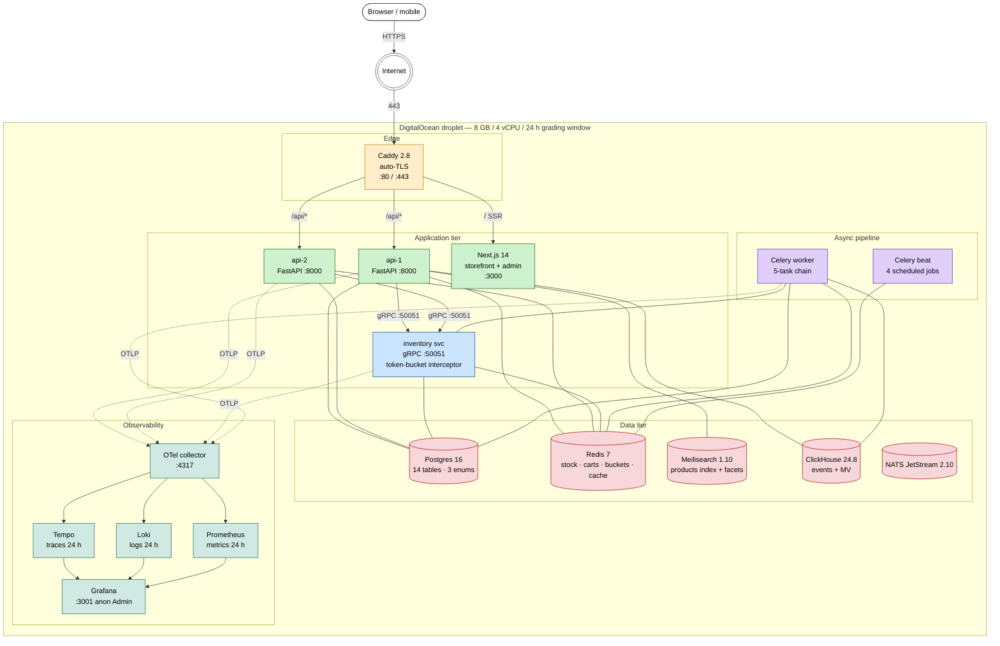
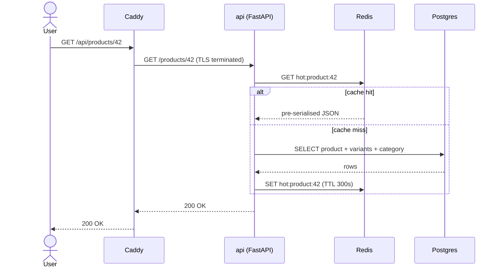
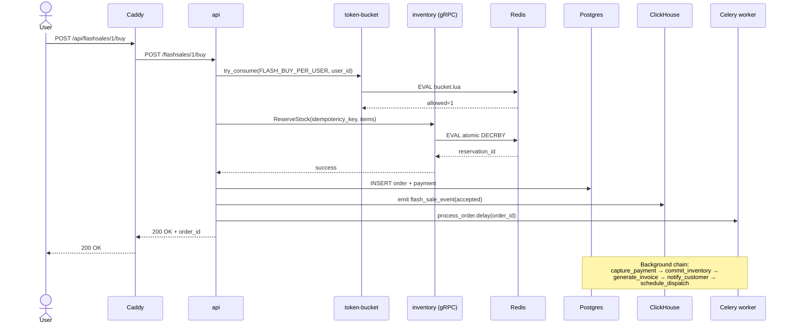
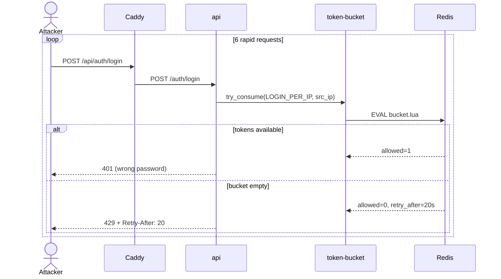

# System architecture

Single source for the architecture diagram. Renders directly in
GitHub thanks to Mermaid. Export to PNG for the design report by
opening this file in [Mermaid Live Editor](https://mermaid.live/),
pasting the block, and using its PNG export — save as
`architecture.png` next to this file.

## Topology

## Request paths

Three representative flows that the report and viva can step through.

### 1. Browse catalogue (read-heavy, cached)

### 2. Flash-sale buy (the hot path R6 tests)

### 3. Login under credential-stuffing attack (rate limiter in action)

## What lives where in the repo

| Box on the diagram | Source code |
|---|---|
| Caddy | `gateway/Caddyfile`, `gateway/Dockerfile` |
| api ×2 | `api/app/main.py` + `api/app/routers/` |
| inventory svc | `inventory/app/server.py` + `inventory/app/service.py` |
| Frontend | `frontend/app/` (Next.js App Router) |
| Token-bucket | `api/app/ratelimit/` and `inventory/app/ratelimit/` |
| Celery chain | `api/app/tasks/order.py` |
| Celery beat | `api/app/tasks/scheduled.py` |
| ClickHouse schema | `scripts/clickhouse_init.sql` |
| OTel + Grafana | `observability/` |
| Compose orchestration | `docker-compose.yml` |
